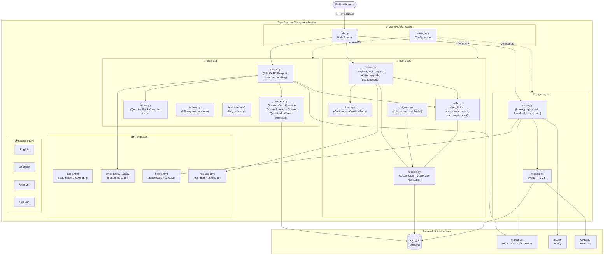
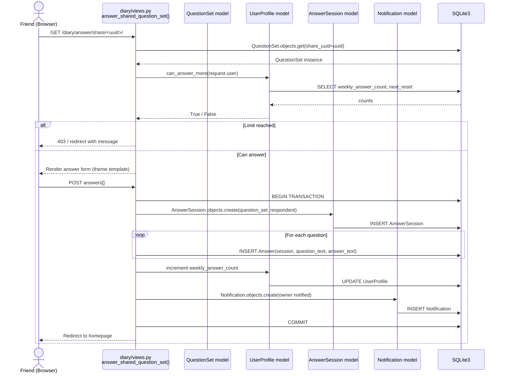

# DearDiary — UML Diagrams

## 1. Component Diagram

Shows the major Django applications, their internal modules, and how they connect to each other and external services.



---

## 2. Activity Diagram — Core User Flow

Shows the end-to-end journey: registration → diary creation → sharing → answering → viewing responses.

```mermaid
flowchart TD
    A([Start: User visits DearDiary]) --> B{Authenticated?}

    B -- No --> C[Register / Login]
    C --> D{Registration\nor Login?}
    D -- Register --> E[Fill CustomUserCreationForm]
    E --> F[Create CustomUser\n+ UserProfile via signal]
    F --> G[Redirect to Homepage]
    D -- Login --> H[Authenticate credentials]
    H --> I{Valid?}
    I -- No --> C
    I -- Yes --> G

    B -- Yes --> G

    G[Homepage\nNews · Leaderboard\nProfile summary] --> J{User action?}

    J -- Create Diary --> K[Go to /diary/create/]
    K --> L[Fill title, description,\nselect visual style]
    L --> M{Free plan limit\nreached?}
    M -- Yes --> N[Show upgrade banner\n→ /users/upgrade/]
    N --> J
    M -- No --> O[Save QuestionSet\nwith UUID + slug]
    O --> P[Add / Edit Questions\n/diary/my-question-set/slug/]
    P --> Q[Copy shareable link\n/diary/answer/share/uuid/]
    Q --> R([Share link with friends])

    J -- View my diaries --> S[/diary/\nList of owned question sets]
    S --> T[Select a diary]
    T --> U[Owner view:\nstats + list of respondents]
    U --> V{Action?}
    V -- View response --> W[/diary/response/session_id/\nRead answers]
    W --> X{Download PDF?}
    X -- Yes --> Y[Playwright renders PDF\n/diary/response/session_id/download/]
    X -- No --> U
    V -- Edit questions --> P

    J -- View notifications --> Z[/users/profile/\nNotification list + stats]

    subgraph FriendFlow ["Friend / Respondent Flow"]
        R --> AA([Friend opens UUID link])
        AA --> AB{Friend authenticated?}
        AB -- No --> AC[Redirect to login]
        AC --> AB
        AB -- Yes --> AD{Owns this diary?}
        AD -- Yes --> AE[Redirect: cannot answer own diary]
        AD -- No --> AF{Weekly answer\nlimit reached?}
        AF -- Yes --> AG[Show limit message\nwith upgrade prompt]
        AF -- No --> AH[Render answer form\nin selected theme style]
        AH --> AI[Friend fills in answers]
        AI --> AJ[POST → create AnswerSession\n+ Answer records]
        AJ --> AK[Increment weekly_answer_count\non friend's UserProfile]
        AK --> AL[Create Notification\nfor diary owner]
        AL --> AM[Redirect friend to Homepage]
    end

    AL -.->|Owner sees notification| Z
```

---

## 3. Sequence Diagram — Answering a Shared Diary

Detailed interaction between the browser, Django views, models, and the database when a friend answers a diary.


