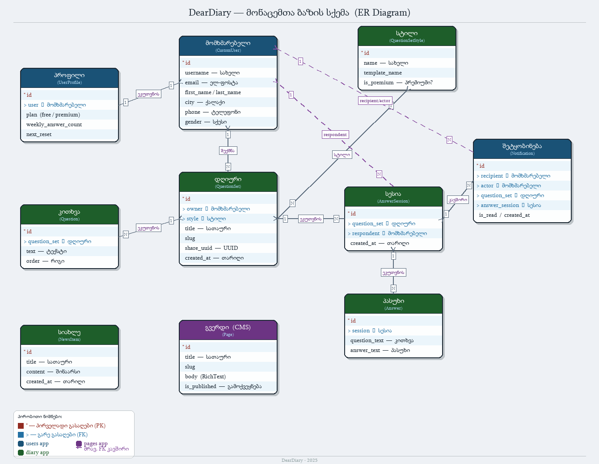
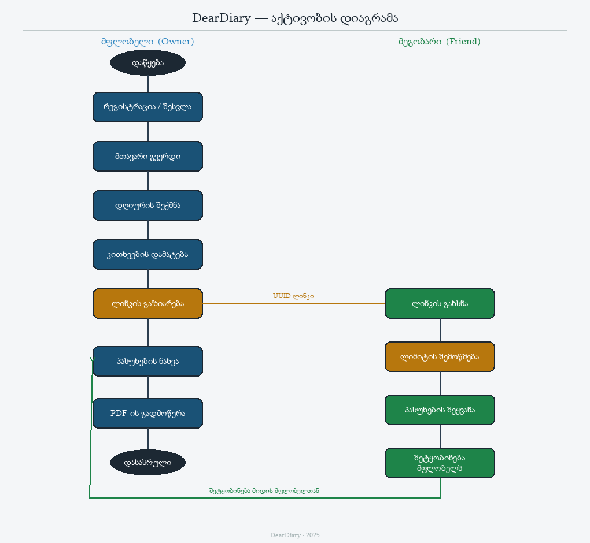
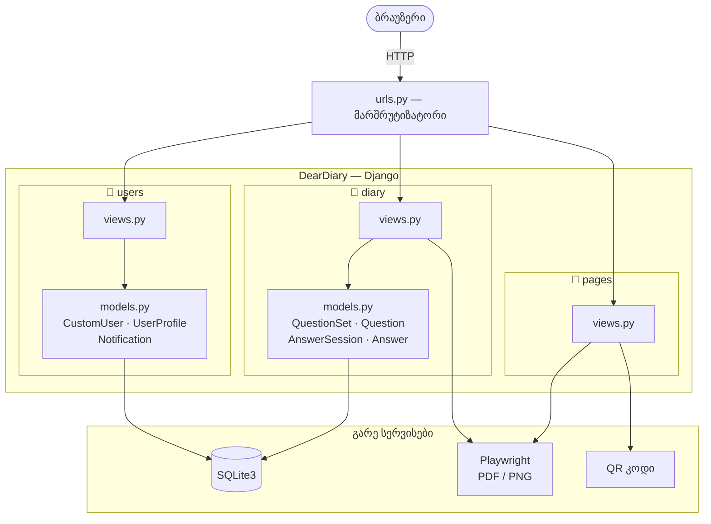
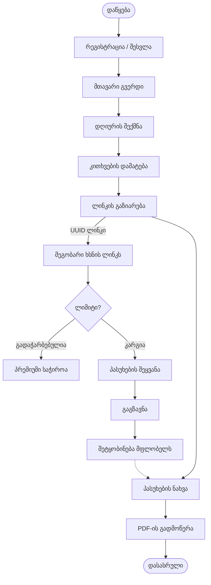

# DearDiary — დიაგრამები

## ER დიაგრამა — მონაცემთა ბაზის სქემა (PNG)

> `*` = პირველადი გასაღები (PK) · `>` = გარე გასაღები (FK)
> ლურჯი = users app · მწვანე = diary app · იასამნისფერი = pages app

---

## აქტივობის დიაგრამა (PNG)

---

## კომპონენტების დიაგრამა

სისტემის მთავარი ნაწილები და მათი კავშირები.

---

## აქტივობის დიაგრამა (Mermaid)

მომხმარებლის მთავარი მარშრუტი: რეგისტრაცია → დღიურის შექმნა → გაზიარება → პასუხი → ნახვა.

